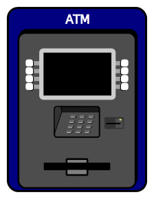

# ATM Exercise Refactoring
Simple React ATM

## Description
This simple React ATM can keep track of the account balance after deposits and withdrawals. If the amount of money intended to be withdrawn is greater than the balance, the transaction will not proceed and an alert will display.

## How to Run
Fork this repo to your own, clone it to your local machine, run the project in your local server by running "http-server -c-1" in the local folder.

## Future development
I would like to improve this ATM by adding the following functionalities:
1. keep track of the deposit and withdrawal records
2. enable log in and log out with username and password
